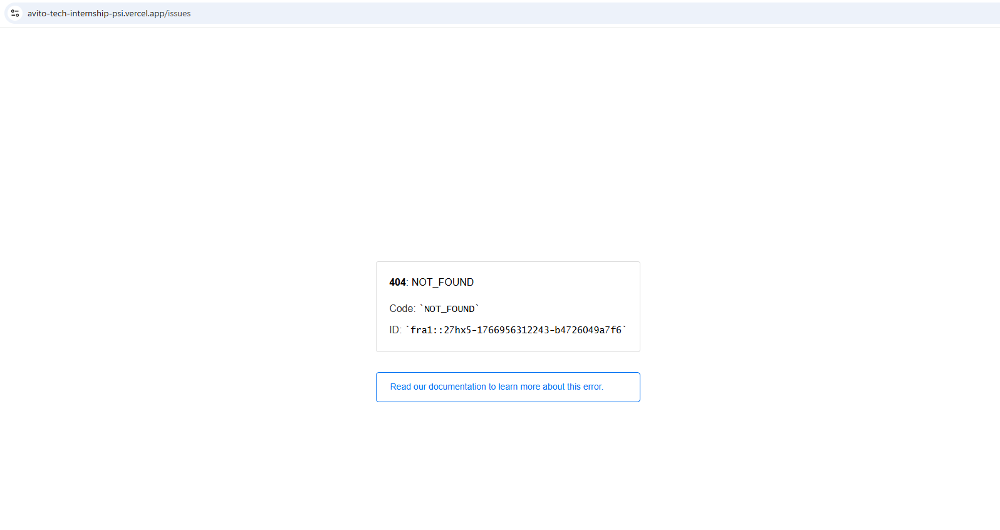
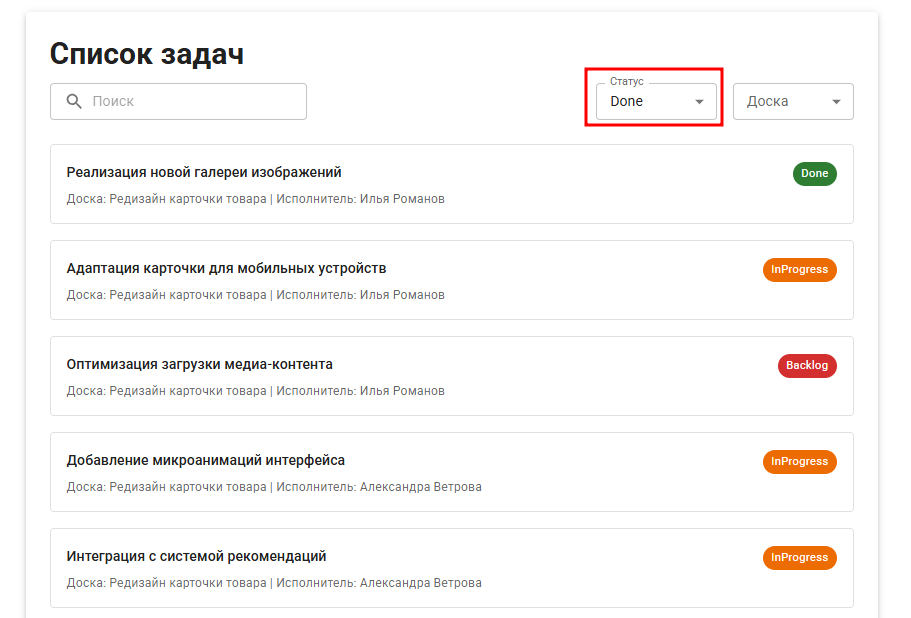

## Баг-репорты

### BR1. Ошибка 404 отображается при обновлении страницы

**ID:** BR1

**Проект:** Таск-трекер

**Шаги воспроизведения:**
1. Открыть страницу по адресу https://avito-tech-internship-psi.vercel.app/
2. Обновить страницу (F5 или кнопка обновления браузера)

**Фактический результат:** На экране отображается ошибка 404

**Ожидаемый результат:** Страница успешно обновляется, сохраняется текущий контент

**Приоритет:** High

**Серьезность:** Critical

**Статус:** New

**Окружение:**
- ОС: Windows 10
- Браузер: Google Chrome версия: 143.0.7499.170 (официальная сборка) (64 бит)

**Вложения:**  

---

### BR2. Фильтр "Статус" не исключает задачи с другими статусами из результатов поиска при выборе "Done"

**ID:** BR2

**Проект:** Таск-трекер

**Шаги воспроизведения:**
1. Открыть страницу по адресу https://avito-tech-internship-psi.vercel.app/
2. Нажать на фильтр "Статус"
3. Нажать на статус "Done"
4. Дождаться загрузки списка задач

**Фактический результат:** В списке задач отображаются задачи со статусом "Done","InProgress","Backlog"

**Ожидаемый результат:** В списке задач отображаются только задачи со статусом "Done"

**Приоритет:** High

**Серьезность:** Major

**Статус:** New

**Окружение:**
- ОС: Windows 10
- Браузер: Google Chrome версия: 143.0.7499.170 (официальная сборка) (64 бит)

**Вложения:**  

